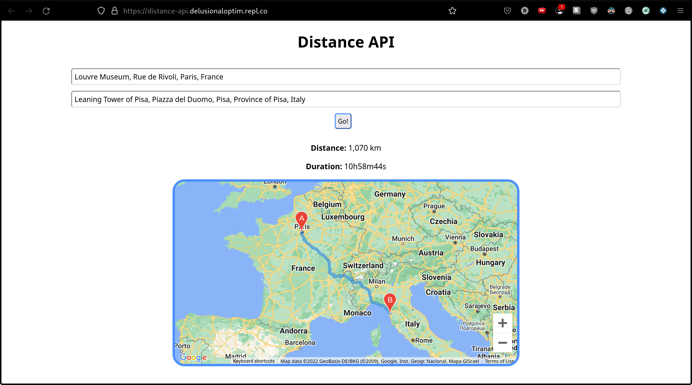

# Distance API
A minimalistic app using Google Maps' APIs to get the distance and plot a route between two addresses.


## Try it out
### Live
Checkout the live version at: https://distance-api.delusionaloptim.repl.co

### Docker
```
docker run -p 8080:8080 delusionaloptimist/distance-api:latest
```

### Build and run locally
```
make run
```

## Google Maps APIs used
* [Distance Matrix API](https://developers.google.com/maps/documentation/distance-matrix/overview) - for calculating distance
* [Places API](https://developers.google.com/maps/documentation/places/web-service/overview) - for autocomplete
* [JavaScript API](https://developers.google.com/maps/documentation/javascript/overview) - for rendering and showing route on map

## Stack
* Go
* JS
* HTML
* CSS
